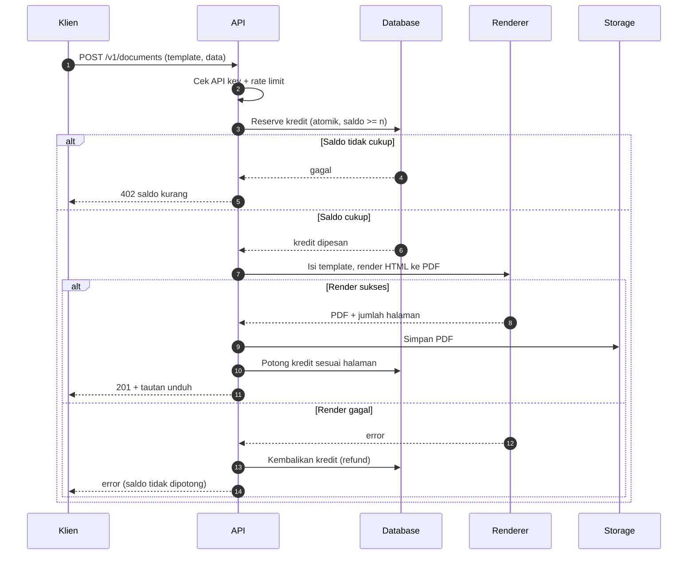
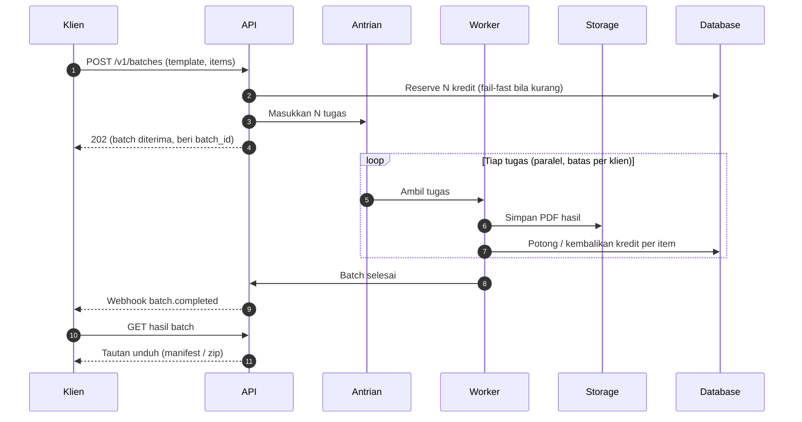
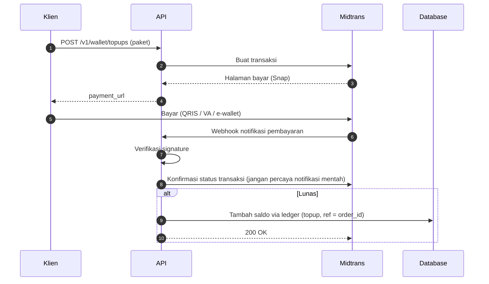

# 19 — Diagram Alur (Sequence)

Diagram urutan untuk melengkapi dokumen arsitektur (01). Ditulis dalam Mermaid sehingga tampil otomatis di GitHub dan bisa disunting sebagai teks.

## 1. Render Dokumen Tunggal (Sinkron)

## 2. Generate Massal (Batch, Asinkron)

## 3. Top-up Saldo (Midtrans)

Catatan: detail tiap langkah ada di dokumen terkait — render & kredit (00, 03, 08), batch & keadilan (06), serta pembayaran (03, 07).
